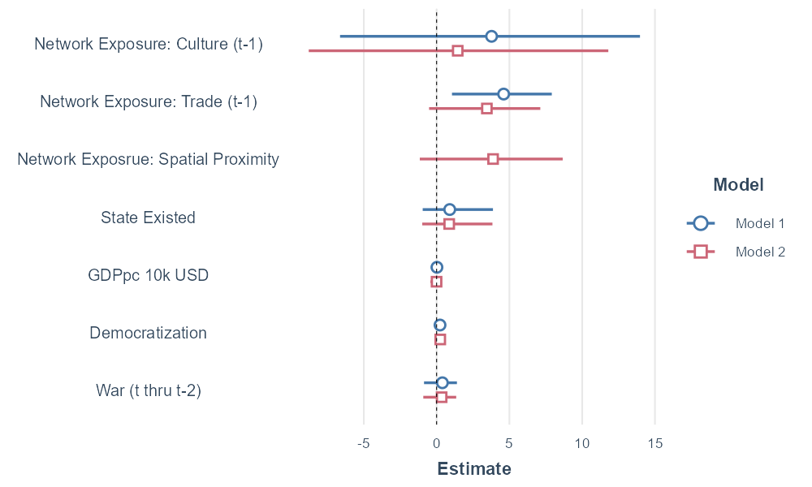

```{r setup}
rm(list = ls(all = T))

pacman::p_load('netdiffuseR','stargazer','tidyverse','dplyr','countrycode','sandwich','lmtest','jtools','ragg','webshot','kableExtra','knitr','rvest','nnet')

load("data/unemp.Rdata")
```

1918 is the first adoption, so the first time-dummy should capture most years before that. All countries that are non-adopters, plus those that adopted after 2010 are recoded to 3000

```{r finalprep, warning = F, message = F}
# -----------------------------------------------------------------
# -----------------------------------------------------------------
# - 8. !! estimate discrete-time logistic hazard model !!
# -----------------------------------------------------------------
# -----------------------------------------------------------------
# --- check cases never in risk set
# --- check toa 1880 !!!
# head(diff_data)

# First law is in 1918, so start with 1915 for the time-series

diff_data <- diff_data[diff_data$per > 1900,]

# Create a relative GDP measure, this puts the country in its global position and follows this changing position over time
diff_data <- diff_data %>%
  group_by(per) %>%
  mutate(gdp_year_mean = mean(gdp10000, na.rm = T)) %>%
  ungroup()

diff_data <- diff_data %>%
  mutate(gdp_rel = gdp10000 - gdp_year_mean)
# Recode non-adopters to 2500
diff_data$toa[is.na(diff_data$toa)] <- 3000
```


```{r main_models, warning = F, message = F}
model1 <- glm(adopted ~ 
              + t21_49 
              + t50_74 
              + t75_99 
              + t100_130  
              #+ lag_w_expo_culture 
              #+ w_expo_colony
              #+ lag_w_expo_trade
              + gdp_rel
              + regime
              + 0,
      dat    = diff_data, 
      subset = (per <= toa), # - extremely important !
      family = binomial(link="logit"))
summary(model1)
exp(coef(model1))

model2 <- glm(adopted ~ 
              + t21_49 
              + t50_74 
              + t75_99 
              + t100_130  
              + gdp_rel
              + regime
              + atwar_any
              + 0,
              dat    = diff_data, 
              subset = (per <= toa),
              family = binomial(link="logit"))

model3 <- glm(adopted ~ 
              + t21_49 
              + t50_74 
              + t75_99 
              + t100_130  
              + gdp_rel
              + regime
              + atwar_any
              + gdp_rel*atwar_any
              + 0,
              dat    = diff_data, 
              subset = (per <= toa),
              family = binomial(link="logit"))

model3a <- glm(adopted ~ 
              + t21_49 
              + t50_74 
              + t75_99 
              + t100_130  
              + gdp_rel
              + regime
              + atwar_any
              + regime*atwar_any
              + 0,
              dat    = diff_data, 
              subset = (per <= toa),
              family = binomial(link="logit"))

model4 <- glm(adopted ~ 
              + t21_49 
              + t50_74 
              + t75_99 
              + t100_130  
              + gdp_rel
              + regime
              + atwar_any
              + gdp_rel*atwar_any
              + lag_w_expo_proximity
              + 0,
              dat    = diff_data, 
              subset = (per <= toa),
              family = binomial(link="logit"))

model4a <- glm(adopted ~ 
              + t21_49 
              + t50_74 
              + t75_99 
              + t100_130  
              + gdp_rel
              + regime
              + atwar_any
              #+ gdp_rel*atwar_any
              + lag_w_expo_proximity
              + 0,
              dat    = diff_data, 
              subset = (per <= toa),
              family = binomial(link="logit"))

model5 <- glm(adopted ~ 
              + t21_49 
              + t50_74 
              + t75_99 
              + t100_130  
              + gdp_rel
              + regime
              + atwar_any
              + gdp_rel*atwar_any
              + lag_w_expo_culture 
              + 0,
              dat    = diff_data, 
              subset = (per <= toa),
              family = binomial(link="logit"))

model5a <- glm(adopted ~ 
              + t21_49 
              + t50_74 
              + t75_99 
              + t100_130  
              + gdp_rel
              + regime
              + atwar_any
              #+ gdp_rel*atwar_any
              + lag_w_expo_culture 
              + 0,
              dat    = diff_data, 
              subset = (per <= toa),
              family = binomial(link="logit"))

#summary(model2)
#exp(coef(model2))
stargazer(model1,model2,model3,model3a,model4,model4a,model5,model5a,
          type = "text", 
          title = "Discrete Time Hazard/Diffusion Models of /nUnemployment Law, 1880-2010 in 164 countries",
          dep.var.labels=c("First Unemp Law"),
          covariate.labels=c("(1901-1929)",
                             "(1930-1954)",
                             "(1955-1979)",
                             "(1980-2010)",
                             "Relative GDP",
                             "Democratization",
                             "War and Aftermath",
                             "Network Exposure: Spatial Proximity",
                             "Network Exposure: Culture (t-1)",
                             "GDP*War",
                             "Dem*War"
                             ),
          out="results/Tbl1.htm")

# webshot("results/Tbl1.htm", file = "results/Tbl1.png")

# 

```


```{r Tbl1_OR, warning = F, message = F}
#we add a command to present odd-ratios

stargazer(model1,model2,model4a,model5a,
          type = "text", 
          title = "Discrete Time Hazard/Diffusion Models of Unemployment, 1880-2010 in 164 countries. Odd-Ratios Shown",
          dep.var.labels=c("Introduction Unemployment Law"),
          covariate.labels=c("(1901-1929)",
                             "(1930-1954)",
                             "(1955-1979)",
                             "(1980-2010)",
                             "Relative GDP",
                             "Democratization",
                             "War and Aftermath",
                             "Network Exposure: Spatial Proximity",
                             "Network Exposure: Culture (t-1)"
                             ),
          apply.coef=exp, t.auto=F, p.auto=F, report = "vct*",
          out="results/Tbl1_OR.htm")

webshot("results/Tbl1_OR.htm", file = "results/Tbl1_OR.png")

# 
```

```{r coefplots, echo = T}
agg_png(filename = "results/Fig1_coeff.png", height = 600, width = 1000, res = 144)
plot_coefs(model2,model4a,model5a, 
           #exp = T,
           coefs = c("Relative GDP" = "gdp_rel",
                             "Democratization" = "regime",
                             "War and Aftermath" = "atwar_any",
                             "Network Exposure: Spatial Proximity" = "lag_w_expo_proximity",
                             "Network Exposure: Culture (t-1)" = "lag_w_expo_culture"),
           #colors = c("springgreen","forestgreen","darkorange"), 
           title = "Logit Coefficients for Unemployment Law Models") +
  xlab(label = "Coefficients & 99%CI") +
  coord_cartesian(xlim = c(-0.5,3.5)) +
  annotate(geom = "text", x = 2.9, y = 1.8, label = "OR ~ 20") +
  annotate(geom = "text", x = 1.8, y = 3, label = "OR ~ 2.3") +
  annotate(geom = "text", x = 0.8, y = 4, label = "OR ~ 1.3") +
  theme(legend.position = "none")
dev.off()



# omit.coefs = c("t0_25","t25_49","t50_74","t75_99","t100_130")
```

### Percentage Adoption by War

```{r pwar}
pwar <- subset(diff_data, select = c(id, atwar_any, per, adopted))
pwar_c <- pwar %>%
  group_by(id) %>%
  summarise(adopt_any = max(adopted),
            war_any = max(atwar_any),
            adopt_any = ifelse(is.na(adopt_any), 0 , adopt_any),
            war_any = ifelse(is.na(war_any), 0, war_any))

pwar_cwar <- pwar %>%
  subset(atwar_any == 1) %>%
  group_by(id) %>%
  summarise(adopt_war = max(adopted),
            adopt_war = ifelse(is.na(adopt_war), 0, adopt_war))

pwar_c <- left_join(pwar_c, pwar_cwar, by = "id")

# create table
Tbl2 <- as.data.frame(matrix(nrow = 5, ncol = 4))
colnames(Tbl2) <- c(" ", "Countries","Adopted Unemployment","Adopted during War or Aftermath")

Tbl2[1,] <- c("War", as.numeric(length(pwar_c$war_any[pwar_c$war_any == 1])), as.numeric(sum(pwar_c$adopt_any[pwar_c$war_any == 1])), as.numeric(sum(pwar_cwar$adopt_war)))

Tbl2[3,] <- c("No War", as.numeric(length(pwar_c$war_any[pwar_c$war_any == 0])), as.numeric(sum(pwar_c$adopt_any[pwar_c$war_any == 0])), 0)

Tbl2[5,] <- c("Total", as.numeric(Tbl2[1,2]) + as.numeric(Tbl2[3,2]), as.numeric(Tbl2[1,3]) + as.numeric(Tbl2[3,3]), as.numeric(Tbl2[1,4]) + as.numeric(Tbl2[3,4]))

# column percentages
Tbl2[2,] <- c("col pct",
              paste0(round(100*(as.numeric(Tbl2[1,2])/as.numeric(Tbl2[5,2])),0),"%"),
              paste0(round(100*(as.numeric(Tbl2[1,3])/as.numeric(Tbl2[5,3])),0),"%"),
              paste0(round(100*(as.numeric(Tbl2[1,4])/as.numeric(Tbl2[5,4])),0),"%"))

Tbl2[4,] <- c("col pct",
              paste0(round(100*(as.numeric(Tbl2[3,2])/as.numeric(Tbl2[5,2])),0),"%"),
              paste0(round(100*(as.numeric(Tbl2[3,3])/as.numeric(Tbl2[5,3])),0),"%"),
              paste0(round(100*(as.numeric(Tbl2[3,4])/as.numeric(Tbl2[5,4])),0),"%"))

write.csv(Tbl2, file = "results/Tbl2.csv")
```


```{r net1, echo = T}
# bmp(filename = "results/culture_edu.bmp") # - create folder, mac users adjust
# plot_diffnet(diffnet_culture, 
#             slices = c(1,50,100,130), layout=coords)
#dev.off()

plot_adopters(diffnet_proximity, 
              include.legend = FALSE, what = c("adopt", "cumadopt"), ylim = c(0,0.45), xlim = c(1900,2010))
```


```{r net2, echo = T}
plot_hazard(diffnet_proximity, ylim=c(0,0.1), xlim=c(1900,2010))

```


```{r net3, echo = T}
plot_infectsuscep(diffnet_proximity, logscale = T)
# why is the log scale dropping cases?
```


```{r net3}
# network threshold: required proportion or number of neighbors that leads you to adopt
plot_threshold(diffnet_proximity
               , undirected = FALSE, vertex.size = 1/5)
```


```{r se_corrections}
# ---------------------------------------------
# --- Calculate the  corrected standard errors
# --- the cultural spheres network
# ---------------------------------------------

# Standard error correction: Huber-White standard errors are calculated AFTER the model
# and used to re-calculate the significance

# step 1: calculate corrected standard errors and save output as an object: 


m1 <- lmtest::coeftest(model2, vcov = vcovCL(model2, type="HC3", cluster =~ cluster_id))
# unclear error taking place here


m2 <- coeftest(model4a, vcov = vcovCL(model4a, type="HC3", cluster=~ cluster_id))


m3 <- coeftest(model5a, vcov = vcovCL(model5a, type="HC3", cluster=~ cluster_id))


# cheatsheets for starger modification: https://www.jakeruss.com/cheatsheets/stargazer/
# these work with stargazer 3 as well. 

# change the title, the dep.var.labels and the covariate.labels accordingly

stargazer3(list(m1, m2, m3), odds.ratios = T, origin_model = list(model2, model4a, model5a), type = "text", se = list(NA, NA, NA),
           title = "Diffusion of Work-Inury Law - Cultural Spheres Network",
           dep.var.labels=c("Introduction of Unemployment"),
           covariate.labels=c("(1901-1929)",
                             "(1930-1954)",
                             "(1955-1979)",
                             "(1980-2010)",
                             "Relative GDP",
                             "Democratization",
                             "War and Aftermath",
                             "Network Exposure: Spatial Proximity",
                             "Network Exposure: Culture (t-1)"),
           out="results/models_final2.htm")


```


```{r other}
# ---------------------------------------------
# --- some functions of netdiffuseR, here for 
# --- the cultural spheres network
# ---------------------------------------------

s <- 12345
cols <- c("lightblue","green", "blue")
oldpar <- par(no.readonly = T)
coords <- set.seed(s);plot(diffnet_culture, main="culture & education")


bmp(filename = "results/culture_edu.bmp") # - create folder, mac users adjust
plot_diffnet(diffnet_culture, 
             slices = c(1,50,100,130), layout=coords)
dev.off()

plot_adopters(diffnet_culture, 
              include.legend = FALSE, what = c("adopt", "cumadopt"))
plot_hazard(diffnet_culture, ylim=c(0,1))
plot_infectsuscep(diffnet_culture)

# network threshold: required proportion or number of neighbors that leads you to adopt
plot_threshold(diffnet_culture, undirected = FALSE, vertex.size = 1/5)

# Classify Adopters
diffnet.toa(diffnet_culture)[diffnet_culture$toa==max(diffnet_culture$toa, na.rm = TRUE)] <- NA
out <- classify_adopters(diffnet_culture)
out

# This is one way to combine adopters ad thresholds in one object
round(
  with(out, ftable(toa, thr, dnn=c("Time of Adoption", "Threshold")))/
    nnodes(diffnet_culture[!is.na(diffnet_culture$toa)])*100, digits=2)
ftable(out)

ids <- unique(edgelist_cultural_spheres$ego_id) 
ids <- as.data.frame(ids)

ids1 <- unique(edgelist_cultural_spheres$alter_id) 
ids1 <- as.data.frame(ids1)

colnames(ids1)[1] <- "ids"
ids <- rbind(ids, ids1)
ids <- unique(ids)
ids$ids <- as.character(ids$ids)

ids <- sort(ids)

# Adopter types and threshols combined
thresholds <- cbind(as.data.frame(classify(diffnet_culture)), diffnet_culture$toa, ids)
head(thresholds)


```

