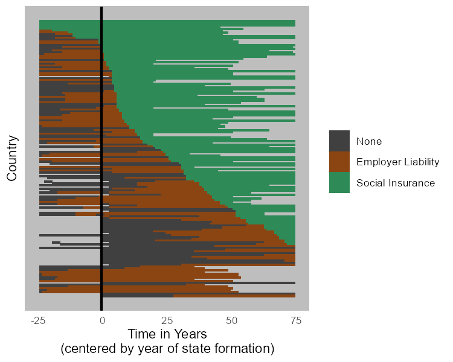

Nate Breznau
Felix Lanver
University of Bremen


```{r setup}
rm(list = ls(all = T))

pacman::p_load('netdiffuseR','stargazer','tidyverse','dplyr','countrycode','sandwich','lmtest','jtools','ragg')

load("data/.Rdata")
```

```{r final_cleaning, warning = F, message = F}
# Recode non-adopters to 2500
diff_data$toa[is.na(diff_data$toa)] <- 2500
diff_data_socins$toa[is.na(diff_data$toa)] <- 2500

# change 'state existed' to, state founded in last 3 years
diff_data <- diff_data %>%
  group_by(id) %>%
  mutate(existence = ifelse(existence - lag(existence) == 1, t, 0),
         existence = max(existence, na.rm = T),
         existence = ifelse(existence == 0, 1880, existence),
         existence = ifelse((t - existence) > -1 & (t - existence) < 4, 1, 0))
```


```{r main_models, warning = F, message = F}
# -----------------------------------------------------------------
# -----------------------------------------------------------------
# - 8. !! estimate discrete-time logistic hazard model !!
# -----------------------------------------------------------------


model1 <- glm(adopted ~ 
              + t0_22 
              + t23_48 
              + t49_74 
              + t75_99 
              + t100_130  
              + existence
              + lag_w_expo_culture 
              + lag_w_expo_colony
              + lag_w_expo_trade
              + gdp10000
              + regime
              + 0,
      dat    = diff_data, 
      subset = (per <= toa), # - extremely important !
      family = binomial(link="logit"))
summary(model1)
exp(coef(model1))

model2 <- glm(adopted ~ 
                + t0_22 
              + t23_48 
              + t49_74 
              + t75_99 
              + t100_130  
              + existence
              + lag_w_expo_culture 
              + lag_w_expo_colony
              + lag_w_expo_trade
              + lag_w_expo_proximity
              + gdp10000
              + regime
              + 0,
              dat    = diff_data, 
              subset = (per <= toa),
              family = binomial(link="logit"))
#summary(model2)
#exp(coef(model2))
stargazer(model1,model2,
          type = "html", 
          title = "Discrete Time Hazard/Diffusion Models of /nWork-Injury Law, 1880-2010 in 173 countries",
          dep.var.labels=c("First Work-Injury Law"),
          covariate.labels=c("(1880-1902)", 
                             "(1903-1928)",
                             "(1929-1954)",
                             "(1955-1979)",
                             "(1980-2010)",
                             "State Founded (last 3 years)", 
                             "Network Exposure: Culture (t-1)",
                             "Network Exposure: Colonial",
                             "Network Exposure: Trade (t-1)",
                             "Network Exposrue: Spatial Proximity",
                             "GDPpc 10k USD",
                             "Democratization" 
                             ),
          out="results/Tbl1.htm")

knitr::include_graphics("results/Tbl1.htm")
```


```{r Tbl1_OR, warning = F, message = F}
#we add a command to present odd-ratios

stargazer(model1,model2,
          type = "html", 
          title = "Discrete Time Hazard/Diffusion Models of /nWork-Injury Law, 1880-2010 in 173 countries",
          dep.var.labels=c("First Work-Injury Law"),
          covariate.labels=c("(1880-1902)", 
                             "(1903-1928)",
                             "(1929-1954)",
                             "(1955-1979)",
                             "(1980-2010)",
                             "State Founded (last 3 years)", 
                             "Network Exposure: Culture (t-1)",
                             "Network Exposure: Colonial",
                             "Network Exposure: Trade (t-1)",
                             "Network Exposrue: Spatial Proximity",
                             "GDPpc 10k USD",
                             "Democratization" 
                             ),
          apply.coef=exp, t.auto=F, p.auto=F, report = "vct*",
          out="results/Tbl1_OR.htm")

knitr::include_graphics("results/Tbl1_OR.htm")
```

```{r coefplots}
agg_png(filename = "results/Fig1.png", height = 600, width = 1000, res = 144)
plot_coefs(model1,model2, coefs = c("Network Exposure: Culture (t-1)" = "lag_w_expo_culture",
                                    "Network Exposure: Colonial" = "lag_w_expo_colony",
                                    "Network Exposure: Trade (t-1)" = "lag_w_expo_trade",
                                    "Network Exposrue: Spatial Proximity" = "lag_w_expo_proximity", 
                                    "State Founded (last 3 years)" = "existence",
                                    "GDPpc 10k USD" = "gdp10000", 
                                    "Democratization" = "regime"), colors = "Qual3", title = "Logit Coefficients for Work-Injury Introductory Laws Models")
dev.off()



# omit.coefs = c("t0_25","t25_49","t50_74","t75_99","t100_130")
```


```{r net1}
# ---------------------------------------------
# --- some functions of netdiffuseR, here for 
# --- the cultural spheres network
# ---------------------------------------------

s <- 12345
cols <- c("lightblue","green", "blue")
oldpar <- par(no.readonly = T)
coords <- set.seed(s);plot(diffnet_culture, main="Culture and Work-Injury Law")
```


```{r net2}
# bmp(filename = "results/culture_edu.bmp") # - create folder, mac users adjust
# plot_diffnet(diffnet_culture, 
#             slices = c(1,50,100,130), layout=coords)
#dev.off()

# plot_adopters(diffnet_culture, 
#              include.legend = FALSE, what = c("adopt", "cumadopt"))
plot_hazard(diffnet_culture, ylim=c(0,1))
```


```{r net2}
plot_infectsuscep(diffnet_culture)
```


```{r net3}
# network threshold: required proportion or number of neighbors that leads you to adopt
plot_threshold(diffnet_culture, undirected = FALSE, vertex.size = 1/5)
```
```{r net3}
# network threshold: required proportion or number of neighbors that leads you to adopt
plot_threshold(diffnet_trade, undirected = FALSE, vertex.size = 1/5)
```

```{r net4}
# Classify Adopters
diffnet.toa(diffnet_culture)[diffnet_culture$toa==max(diffnet_culture$toa, na.rm = TRUE)] <- NA
out <- classify_adopters(diffnet_culture)


# This is one way to combine adopters ad thresholds in one object
round(
  with(out, ftable(toa, thr, dnn=c("Time of Adoption", "Threshold")))/
    nnodes(diffnet_culture[!is.na(diffnet_culture$toa)])*100, digits=2)
# ftable(out)

ids <- unique(edgelist_cultural_spheres$ego_id) 
ids <- as.data.frame(ids)

ids1 <- unique(edgelist_cultural_spheres$alter_id) 
ids1 <- as.data.frame(ids1)

colnames(ids1)[1] <- "ids"
ids <- rbind(ids, ids1)
ids <- unique(ids)
ids$ids <- as.character(ids$ids)

ids <- sort(ids)

# Adopter types and threshols combined
thresholds <- cbind(as.data.frame(classify(diffnet_culture)), diffnet_culture$toa, ids)
head(thresholds)
```

```{r net1_trade}


plot_threshold(diffnet_trade, undirected = FALSE, vertex.size = 1/5)

```

```{r se_corrections}
# ---------------------------------------------
# --- Calculate the  corrected standard errors
# --- the cultural spheres network
# ---------------------------------------------

# Standard error correction: Huber-White standard errors are calculated AFTER the model
# and used to re-calculate the significance

# step 1: calculate corrected standard errors and save output as an object: 


m1 <- lmtest::coeftest(model1, vcov = vcovCL(model1, type="HC3", cluster =~ cluster_id))
# unclear error taking place here


m1               
summary(model1)

m2 <- coeftest(model2, vcov = vcovCL(model2, type="HC3", cluster=~ cluster_id))

m2

m3 <- coeftest(model3, vcov = vcovCL(model3, type="HC3", cluster=~ cluster_id))

m3

m4 <- coeftest(model4, vcov = vcovCL(model4, type="HC3", cluster=~ cluster_id))

m4

# step 2: run stargazer3 with the following specification: 

# 1. odds.rations = T !SPELLING! 

# 2. stargazer3(list(m1, m2)...) this is the output of the coeftest function with the corrected
# standard erors!! NOT THE GLM OUTPUT !!

# 3. origin_model: GLM output. This is nessesary to add the model fit statistics to the table.


# BEWARE of the covariate label order!! All your models need the independent variables
# in the same order. If you have multiple models, add the ALL independent variable names to the function call below under covariate.labels!!
# If one model has less variables, this space will be empty only for that model.

# cheatsheets for starger modification: https://www.jakeruss.com/cheatsheets/stargazer/
# these work with stargazer 3 as well. 

# change the title, the dep.var.labels and the covariate.labels accordingly

stargazer3(list(m1, m2, m3, m4), odds.ratios = T, origin_model = list(model1, model2, model3, model4), type = "html", se = list(NA, NA, NA, NA),
           title = "Diffusion of Work-Inury Law - Cultural Spheres Network",
           dep.var.labels=c("Introduction of Compulsory Schooling"),
           covariate.labels=c("rate t(0-24)", 
                              "rate t(25-49)",
                              "rate t(50-74)",
                              "rate t(75-99)",
                              "rate t(100-130)",
                              "state existed (=1,else=0)", 
                              "GDP per capita / 10000 USD",
                              "democratization" ,
                              "cultural spheres netw.: w. exposure (lag 1 year)",
                              "colonies netw.: exposure ",
                              "trade net: w. exposure (lag 1 year)",
                              "spatial proximity netw.: w. exposure "
                              ),
           out="results/models_final2.htm")

# ---------------------------------------------
# --- some functions of netdiffuseR, here for 
# --- the cultural spheres network
# ---------------------------------------------

s <- 12345
cols <- c("lightblue","green", "blue")
oldpar <- par(no.readonly = T)
coords <- set.seed(s);plot(diffnet_culture, main="culture & education")


bmp(filename = "results/culture_edu.bmp") # - create folder, mac users adjust
plot_diffnet(diffnet_culture, 
             slices = c(1,50,100,130), layout=coords)
dev.off()

plot_adopters(diffnet_culture, 
              include.legend = FALSE, what = c("adopt", "cumadopt"))
plot_hazard(diffnet_culture, ylim=c(0,1))
plot_infectsuscep(diffnet_culture)

# network threshold: required proportion or number of neighbors that leads you to adopt
plot_threshold(diffnet_culture, undirected = FALSE, vertex.size = 1/5)

# Classify Adopters
diffnet.toa(diffnet_culture)[diffnet_culture$toa==max(diffnet_culture$toa, na.rm = TRUE)] <- NA
out <- classify_adopters(diffnet_culture)
out

# This is one way to combine adopters ad thresholds in one object
round(
  with(out, ftable(toa, thr, dnn=c("Time of Adoption", "Threshold")))/
    nnodes(diffnet_culture[!is.na(diffnet_culture$toa)])*100, digits=2)
ftable(out)

ids <- unique(edgelist_cultural_spheres$ego_id) 
ids <- as.data.frame(ids)

ids1 <- unique(edgelist_cultural_spheres$alter_id) 
ids1 <- as.data.frame(ids1)

colnames(ids1)[1] <- "ids"
ids <- rbind(ids, ids1)
ids <- unique(ids)
ids$ids <- as.character(ids$ids)

ids <- sort(ids)

# Adopter types and threshols combined
thresholds <- cbind(as.data.frame(classify(diffnet_culture)), diffnet_culture$toa, ids)
head(thresholds)


```

