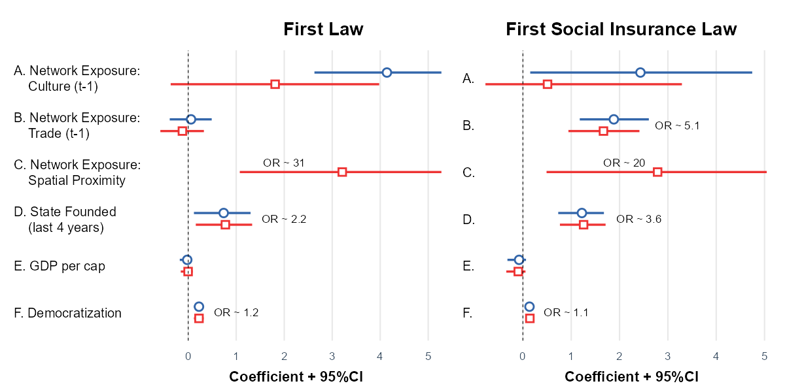

Nate Breznau, breznau.nate@gmail.com
Felix Lanver, felix.lanver@icloud.com

University of Bremen


```{r setup}
rm(list = ls(all = T))

pacman::p_load('netdiffuseR','stargazer','tidyverse','dplyr','countrycode','sandwich','lmtest','jtools','ragg','ggpubr','rvest','nnet','knitr','Hmisc','survminer','survival')

load("data/.Rdata")

knitr::opts_chunk$set(echo = T)
```

## 1. Final Data Touch Ups


```{r final_cleaning, warning = F, message = F}
# remove missing cases
diff_data <- diff_data[!is.na(diff_data$gdp),]
diff_data_socins <- diff_data_socins[!is.na(diff_data_socins$gdp),]
# Recode non-adopters to 2500
diff_data$toa[is.na(diff_data$toa)] <- 2500
diff_data_socins$toa[is.na(diff_data_socins$toa)] <- 2500

# change 'state existed' to, state founded in last 4 years. We also take the year before formation to account for measurement error in law and state formation timing.

# FIRST LAW
diff_data <- diff_data %>%
  group_by(id) %>%
  mutate(existence = ifelse(existence < 1880, 1880, existence),
         existence = ifelse((per - existence) > -2 & (per - existence) < 5, 1, 0))

# SOCINS
diff_data_socins <- diff_data_socins %>%
  group_by(id) %>%
  mutate(existence = ifelse(existence < 1880, 1880, existence),
         year_nation = existence,
         formation = per - year_nation, # for treatment effect plot
         existence = ifelse((per - existence) > -2 & (per - existence) < 5, 1, 0))

treat_plot <- select(diff_data_socins, toa, id, per, formation, year_nation)
colnames(treat_plot) <- c("socins" ,"id","per","formation","year_nation")
treat_plot <- left_join(treat_plot, diff_data, by = c("id","per"))

# Create relative GDP and ag measures, this puts the country in its global position and follows this changing position over time. Without this change, a lower GDP/higher agricutlrue percent simply predicts year (i.e. lower/higher reflets an earlier year). Also create within country GDP (and trim GDP outliers).

diff_data <- diff_data %>%
  group_by(per) %>%
  mutate(gdp_year_mean = mean(gdp10000, na.rm = T),
         ag_year_mean = mean(pct_ag_01_i, na.rm = T)) %>%
  ungroup()

diff_data <- diff_data %>%
  mutate(gdp_rel = gdp10000 - gdp_year_mean,
         ag_rel = pct_ag_01_i - ag_year_mean) %>%
  group_by(id) %>%
  mutate(gdp_id_mean = mean(gdp10000, na.rm = T),
         gdp_within = gdp10000 - gdp_id_mean)

diff_data_socins <- diff_data_socins %>%
  group_by(per) %>%
  mutate(gdp_year_mean = mean(gdp10000, na.rm = T),
         ag_year_mean = mean(pct_ag_01_i, na.rm = T)) %>%
  ungroup()

diff_data_socins <- diff_data_socins %>%
  mutate(gdp_rel = gdp10000 - gdp_year_mean,
         ag_rel = pct_ag_01_i - ag_year_mean) %>%
  group_by(id) %>%
  mutate(gdp_id_mean = mean(gdp10000, na.rm = T),
         gdp_within = gdp10000 - gdp_id_mean)

# create sequence variable (1= no law, 2 = liability/fund, 3 = social insurance)
treat_plot <- treat_plot %>%
  mutate(law_seq = ifelse(per < toa, 1, 2),
         law_seq = ifelse(law_seq == 2 & per >= socins, 3, law_seq))
```

## 2. Main Models

### First Law

We run three discrete-time logistic hazard models:
1. Without main test variable nation formation and without spatial proximity
2. With main test variable nation formation but without spatial proximity
3. All

We tested relative GDP, within-country GDP variance and regular GDP, none produced any effects at all.

```{r main_models, warning = F, message = F}

model1 <- glm(adopted ~ 
              + t0_22 
              + t23_48 
              + t49_74 
              + t75_99 
              + t100_130  
              + lag_w_expo_culture 
              #+ w_expo_colony
              + lag_w_expo_trade
              + gdp10000
              + regime
              + 0,
      dat    = diff_data, 
      subset = (per <= toa), # - extremely important !
      family = binomial(link="logit"))

model2 <- glm(adopted ~ 
              + t0_22 
              + t23_48 
              + t49_74 
              + t75_99 
              + t100_130  
              + existence
              + lag_w_expo_culture 
              #+ w_expo_colony
              + lag_w_expo_trade
              + gdp10000
              + regime
              + 0,
              dat    = diff_data, 
              subset = (per <= toa),
              family = binomial(link="logit"))

model3 <- glm(adopted ~ 
                + t0_22 
              + t23_48 
              + t49_74 
              + t75_99 
              + t100_130  
              + existence
              + lag_w_expo_culture 
              #+ w_expo_colony
              + lag_w_expo_trade
              + lag_w_expo_proximity
              + gdp10000
              + regime
              + 0,
              dat    = diff_data, 
              subset = (per <= toa),
              family = binomial(link="logit"))

model3a <- glm(adopted ~ 
                + t0_22 
              + t23_48 
              + t49_74 
              + t75_99 
              + t100_130  
              + existence
              + lag_w_expo_culture 
              #+ w_expo_colony
              + lag_w_expo_trade
              + lag_w_expo_proximity
              + gdp10000
              + gdp10000*existence
              + regime
              + 0,
              dat    = diff_data, 
              subset = (per <= toa),
              family = binomial(link="logit"))

#summary(model2)
#exp(coef(model2))
stargazer(model1,model2,model3,
          type = "text", 
          title = "Discrete Time Hazard/Diffusion Models of /nWork-Injury Law, 1880-2010 in 164 countries",
          dep.var.labels=c("First Work-Injury Law"),
          covariate.labels=c("(1880-1902)", 
                             "(1903-1928)",
                             "(1929-1954)",
                             "(1955-1979)",
                             "(1980-2010)",
                             "State Founded (last 4 years)", 
                             "Network Exposure: Culture (t-1)",
                             #"Network Exposure: Colonial",
                             "Network Exposure: Trade (t-1)",
                             "Network Exposure: Spatial Proximity",
                             "GDPpc 10k USD",
                             "Democratization" 
                             ),
          out="results/Tbl1.htm")

# knitr::include_graphics("results/Tbl1.htm")
```

### Social Ins

```{r main_models_socins, warning = F, message = F}

model1_socins <- glm(adopted ~ 
              + t0_22 
              + t23_48 
              + t49_74 
              + t75_99 
              + t100_130  
              + lag_w_expo_culture 
              #+ w_expo_colony
              + lag_w_expo_trade
              + gdp10000
              + regime
              + 0,
      dat    = diff_data_socins, 
      subset = (per <= toa), # - extremely important !
      family = binomial(link="logit"))

model2_socins <- glm(adopted ~ 
                + t0_22 
              + t23_48 
              + t49_74 
              + t75_99 
              + t100_130  
              + existence
              + lag_w_expo_culture 
              #+ w_expo_colony
              + lag_w_expo_trade
              + gdp10000
              + regime
              + 0,
              dat    = diff_data_socins, 
              subset = (per <= toa),
              family = binomial(link="logit"))

model3_socins <- glm(adopted ~ 
                + t0_22 
              + t23_48 
              + t49_74 
              + t75_99 
              + t100_130  
              + existence
              + lag_w_expo_culture 
              #+ w_expo_colony
              + lag_w_expo_trade
              + lag_w_expo_proximity
              + gdp10000
              + regime
              + 0,
              dat    = diff_data_socins, 
              subset = (per <= toa),
              family = binomial(link="logit"))
#summary(model2)
#exp(coef(model2))
stargazer(model1_socins,model2_socins,model3_socins,
          type = "text", 
          title = "Discrete Time Hazard/Diffusion Models of /nWork-Injury Law, 1880-2010 in 152 countries",
          dep.var.labels=c("First Work-Injury Social Insurance Law"),
          covariate.labels=c("(1880-1902)", 
                             "(1903-1928)",
                             "(1929-1954)",
                             "(1955-1979)",
                             "(1980-2010)",
                             "State Founded (last 4 years)", 
                             "Network Exposure: Culture (t-1)",
                             #"Network Exposure: Colonial",
                             "Network Exposure: Trade (t-1)",
                             "Network Exposrue: Spatial Proximity",
                             "GDPpc 10k USD",
                             "Democratization" 
                             ),
          out="results/Tbl2.htm")

```


### Coef Plots

We run these at 99% confidence but label it at 95, because in the robust clustered standard errors in Table 1, they only make the 95% CI cutoff (they are close). I haven't found an easy way to use robust se's in a coef_plot so this is the next best option as they are very similar

#### First Law

```{r coefplots, echo = T, message = F, warning = F}

plot1 <- plot_coefs(model2,model3, 
                    ci.level = 0.99,
                    coefs = c("A. Network Exposure:\n    Culture (t-1)" = "lag_w_expo_culture",
                                    #"B. Network Exposure:\n    Colonial" = "w_expo_colony",
                                    "B. Network Exposure:\n    Trade (t-1)" = "lag_w_expo_trade",
                                    "C. Network Exposure:\n    Spatial Proximity" = "lag_w_expo_proximity", 
                                    "D. State Founded\n    (last 4 years)" = "existence",
                                    "E. GDP per cap" = "gdp10000", 
                                    "F. Democratization" = "regime"), colors = "Qual3") +
  annotate(geom = "text", x = 2, y = 4.2, label = "OR ~ 31", size = 3) +
  annotate(geom = "text", x = 2, y = 3, label = "OR ~ 2.2", size = 3) +
  annotate(geom = "text", x = 1, y = 1, label = "OR ~ 1.2", size = 3) +
  coord_cartesian(xlim = c(-0.5,5)) + 
  theme(legend.position = "none",
        axis.text.y = element_text(hjust = 0)) +
  labs(title = "                          First Law") +
  xlab(label = "Coefficient + 95%CI")


```

#### Social insurance


```{r coefplots_socins, echo = T, warning = F, message = F}

plot2 <- plot_coefs(model2_socins,model3_socins,
                    ci.level = 0.99,
                    coefs = c("A." = "lag_w_expo_culture", 
                              #"B" = "w_expo_colony", 
                              "B." = "lag_w_expo_trade", 
                              "C." = "lag_w_expo_proximity", 
                              "D." = "existence", 
                              "E." = "gdp10000", 
                              "F." = "regime"), 
                    colors = "Qual3") +
  annotate(geom = "text", x = 2.1, y = 4.2, label = "OR ~ 20", size = 3) +
  annotate(geom = "text", x = 2.4, y = 3, label = "OR ~ 3.6", size = 3) +
  annotate(geom = "text", x = 0.9, y = 1, label = "OR ~ 1.1", size = 3) +
  annotate(geom = "text", x = 3.2, y = 5, label = "OR ~ 5.1", size = 3) +
  coord_cartesian(xlim = c(-0.5,5)) + 
  theme(legend.position = "none") +
  labs(title = "    First Social Insurance Law") +
  xlab(label = "Coefficient + 95%CI")


agg_png(filename = "results/Fig2.png", height = 600, width = 1200, res = 144)
ggarrange(plot1, plot2, widths = c(1,0.75))

dev.off()




```

### Table of adoption

```{r pcts, warning = F, message = F}
diff_data_ex <- diff_data[diff_data$existence == 1, ] %>%
  subset(!is.na(id)) %>%
  group_by(id) %>%
  mutate(e = ifelse(toa == per, 1, 0)) %>%
  summarise(enacted = max(e, na.rm = T))

diff_data_ex_socins <- diff_data_socins[diff_data_socins$existence == 1, ] %>%
  subset(!is.na(id)) %>%
  group_by(id) %>%
  mutate(e = ifelse(toa == per, 1, 0)) %>%
  summarise(enacted = max(e, na.rm = T))

all <- diff_data_socins %>% group_by(id) %>% summarise(enacted_ever = max(adopted, na.rm=T))
  
```

Of the 152 countries, `r sum(diff_data_ex$enacted)` enacted a first law and `r sum(diff_data_ex_socins$enacted)` enacted a first social insurance during the first 5 years of nation state formation. Of the `r sum(diff_data_socins$enacted_ever)` countries that ever enacted work-injury social insurance up to 2010, `r round(100*(sum(diff_data_ex_socins$enacted) /sum(all$enacted_ever)),1)` did so during state formation.

### Treatment plot

Plot sequences centered at the formation of nation states

```{r nation_plot, echo = T, warning = F, message = F}

# remove missing
treat_plot <- subset(treat_plot, formation != "Inf")
treat_plot$law_seq <- as.factor(as.character(treat_plot$law_seq, levels = c("1","2","3"), labels = c("None","Liability","Social Insurance")))

# order by formation
treat_plot <- treat_plot %>%
  mutate(order = ifelse(per == socins, formation, -1000),
         order = max(order, na.rm = T),
         order = ifelse(order == -1000, 1000, order))

treat_plot <- treat_plot[order(treat_plot$order),]

treat_plot <- treat_plot %>%
  ungroup() %>%
  mutate(n =  row_number()) 

treat_plot <- treat_plot %>%
  group_by(id) %>%
  mutate(n_id = max(n, na.rm =T)) %>%
  ungroup()


agg_png(filename = "results/Fig1.png", height = 300, width = 500, res = 72)
ggplot(treat_plot, aes(formation, rev(n_id), fill = law_seq)) +
  geom_tile() +
  scale_fill_manual(breaks = c("1", "2", "3"),
  values = c("grey25","chocolate4","seagreen4"),
  labels = c("None", "Employer\nLiability", "Social\nInsurance"),
  ) +
  ylab(label = "Country") +
  xlab(label = "Time in Years\n(centered by year of state formation)") +
  xlim(-25,50) +
  geom_vline(xintercept = -0.5, size = 1) +
  theme_classic() +
  theme(axis.text.y = element_blank(),
        axis.line = element_blank(),
        axis.ticks = element_blank(),
        legend.title = element_blank(),
        panel.background = element_rect(color = "grey", fill = "grey"))
dev.off()

knitr::include_graphics("results/Fig1.png", dpi = 36)

```
### Sesitivity Analysis

Including Agriculture instead of GDP. This still needs work as the period 1990 to 2010 seems to have mostly been interpolated and therefore, not of much use.

```{r sens}
model3_sens <- glm(adopted ~ 
              + t0_22 
              + t23_48 
              + t49_74 
              + t75_99 
              + t100_130  
              + existence
              #+ lag_w_expo_culture 
              #+ w_expo_colony
              + lag_w_expo_trade
              + lag_w_expo_proximity
              #+ ag_rel
              + regime
              + 0,
              dat    = diff_data, 
              subset = (per <= toa),
              family = binomial(link="logit"))

model3_socins_sens <- glm(adopted ~ 
                + t0_22 
              + t23_48 
              + t49_74 
              + t75_99 
              + t100_130  
              + existence
              #+ lag_w_expo_culture 
              #+ w_expo_colony
              + lag_w_expo_trade
              + lag_w_expo_proximity
              + ag_rel
              + regime
              + 0,
              dat    = diff_data_socins, 
              subset = (per <= toa),
              family = binomial(link="logit"))

stargazer(model3_sens,model3_socins_sens,
          type = "text", 
          title = "Discrete Time Hazard/Diffusion Models of /nWork-Injury Law, 1880-2010 in 83 countries",
          dep.var.labels=c("First Work-Injury Social Insurance Law"),

          out="results/Tbl3_ag_sens.htm")
```


### Visualizations

Adoption and Cumulative Adoption over time

Note that here it doesn't matter which diffnet object we use, the underlying adoption data are identical


#### Hazard Rate by Start GDP plot

Create groups within the data. High/Low GDP in 1900 & 2000.

`mean(diff_data$gdp10000[diff_data$per == 1900], na.rm = T)`
[1] 0.1851475
`mean(diff_data$gdp10000[diff_data$per == 2000], na.rm = T)`
[1] 1.214281

```{r net_groups, warning = F, message = F}
gdp_groups <- diff_data %>%
  select(gdp10000, lag_w_expo_proximity, id, per, adopted) %>%
  mutate(gdp_1900 = ifelse(gdp10000 <= 0.2 & per == 1900, 1, 0),
         gdp_2000 = ifelse(gdp10000 <= 1.4 & per == 2000, 1, 0),
         proximity = ifelse(lag_w_expo_proximity <= 0.5 & adopted == 1 & lag(adopted) == 0, 1, 0)) %>%
  group_by(id) %>%
  summarise(gdp1900 = max(gdp_1900, na.rm = T),
            gdp2000 = max(gdp_2000, na.rm = T),
            proxim = max(proximity, na.rm = T))

diff_data_gdp <- left_join(diff_data, gdp_groups, by = "id")
diff_data_socins_gdp <- left_join(diff_data_socins, gdp_groups, by = "id")

# remove NA
diff_data_gdp <- diff_data_gdp[!is.na(diff_data_gdp$adopted),]
diff_data_socins_gdp <- diff_data_socins_gdp[!is.na(diff_data_socins_gdp$adopted),]


# change to survival data, remove objects after adoption
 diff_data_gdp <- diff_data_gdp %>%
  group_by(id) %>%
  mutate(cut = adopted + lag(adopted),
         cut = ifelse(is.na(cut), 0, cut)) %>%
  subset(cut == 1) %>%
  ungroup()

 diff_data_socins_gdp <- diff_data_socins_gdp %>%
  group_by(id) %>%
  mutate(cut = adopted + lag(adopted),
         cut = ifelse(is.na(cut), 0, cut)) %>%
  subset(cut == 1) %>%
  ungroup()

# create Cox regression object
fit1 <- survfit(Surv(per, adopted) ~ gdp1900, data = diff_data_gdp)

fit3 <- survfit(Surv(per, adopted) ~ gdp1900, data = diff_data_socins_gdp)

```


```{r surv1}
agg_png(filename = "results/Fig3_A.png", height = 400, width = 400, res = 72)

ggsurvplot(fit1, data = diff_data_gdp, 
           fun = "event",
           conf.int = T,
           palette = "jco",
           xlim = c(1880,2010),
           break.time.by = 20,
           xlab = "Year",
           legend.labs = c("Start GDP High","Start GDP Low"),
           title = "First Law",
           ylab = "")
dev.off()
knitr::include_graphics("results/Fig3_A.png", dpi = 48)
```


```{r surv3}
agg_png(filename = "results/Fig3_B.png", height = 400, width = 400, res = 72)

ggsurvplot(fit3, data = diff_data_socins_gdp, 
           fun = "event",
           conf.int = T,
           palette = "jco",
           xlim = c(1880,2010),
           break.time.by = 20,
           xlab = "Year",
           legend.labs = c("Start GDP High","Start GDP Low"),
           title = "First Social Insurance",
           ylab = "")
dev.off()
knitr::include_graphics("results/Fig3_B.png", dpi = 48)

```
#### Alternative Adoption Plots

##### First Law

```{r net1_first, echo = T}

plot_adopters(diffnet_proximity, 
              include.legend = FALSE, what = c("adopt", "cumadopt"))
```

##### Social Insurance

```{r net1_socins}
plot_adopters(diffnet_proximity_socins, 
              include.legend = FALSE, what = c("adopt"), ylim = c(0,0.02))
```

```{r net2}

plot_hazard(diffnet_proximity_socins, ylim=c(0,0.2))
```


```{r net3}
plot_infectsuscep(diffnet_trade_socins, logscale = F)
```


```{r net4}
# network threshold: required proportion or number of neighbors that leads you to adopt
plot_threshold(diffnet_trade_socins, undirected = FALSE, vertex.size = 1/5)
```

```{r se_corrections}
# ---------------------------------------------
# --- Calculate the  corrected standard errors
# --- the cultural spheres network
# ---------------------------------------------

# Standard error correction: Huber-White standard errors are calculated AFTER the model
# and used to re-calculate the significance

# step 1: calculate corrected standard errors and save output as an object: 


m1 <- lmtest::coeftest(model1, vcov = vcovCL(model1, type="HC3", cluster =~ cluster_id))
# unclear error taking place here

m2 <- lmtest::coeftest(model2, vcov = vcovCL(model2, type="HC3", cluster=~ cluster_id))

m3 <- lmtest::coeftest(model3, vcov = vcovCL(model3, type="HC3", cluster=~ cluster_id))

m4 <- lmtest::coeftest(model1_socins, vcov = vcovCL(model1_socins, type="HC3", cluster=~ cluster_id))

m5 <- lmtest::coeftest(model2_socins, vcov = vcovCL(model2_socins, type="HC3", cluster=~ cluster_id))

m6 <- lmtest::coeftest(model3_socins, vcov = vcovCL(model3_socins, type="HC3", cluster=~ cluster_id))


# step 2: run stargazer3 with the following specification: 

# 1. odds.ratios = T 

# 2. stargazer3(list(m1, m2)...) this is the output of the coeftest function with the corrected
# standard erors!! NOT THE GLM OUTPUT !!

# 3. origin_model: GLM output. This is nessesary to add the model fit statistics to the table.


# BEWARE of the covariate label order!! All your models need the independent variables
# in the same order. If you have multiple models, add the ALL independent variable names to the function call below under covariate.labels!!
# If one model has less variables, this space will be empty only for that model.

# cheatsheets for starger modification: https://www.jakeruss.com/cheatsheets/stargazer/
# these work with stargazer 3 as well. 

# change the title, the dep.var.labels and the covariate.labels accordingly

stargazer3(list(m1, m2, m3, m4, m5, m6), odds.ratios = T, origin_model = list(model1, model2, model3, model1_socins, model2_socins, model3_socins), type = "text", se = list(NA, NA, NA, NA, NA, NA),
           title = "Diffusion of Work-Injury Laws, 164 Countries, 1880-2010",
           column.labels=c("------", "First Law", "------", "--", "First Social Insurance", "--"),
          covariate.labels=c("(1880-1902)", 
                             "(1903-1928)",
                             "(1929-1954)",
                             "(1955-1979)",
                             "(1980-2010)",
                             "State Founded (last 4 years)", 
                             "Network Exposure: Culture (t-1)",
                             "Network Exposure: Colonial",
                             "Network Exposure: Trade (t-1)",
                             "Network Exposrue: Spatial Proximity",
                             "GDPpc 10k USD",
                             "Democratization" 
                             ),
          #add.lines = list(c("Countries", length(unique(diff_data$id)), length(unique(diff_data$id)), length(unique(diff_data$id)), length(unique(diff_data$id)), length(unique(diff_data$id)), length(unique(diff_data$id)))),
           out="results/models_final2.htm")

# ---------------------------------------------
# --- some functions of netdiffuseR, here for 
# --- the cultural spheres network
# ---------------------------------------------

Tbl1 <- as.data.frame(read_html("results/models_final2.htm") %>% html_table(fill=TRUE))

Tbl1 <- Tbl1[Tbl1$X7 != "",]

write.csv(Tbl1, file = "results/Tbl1.csv")

```

